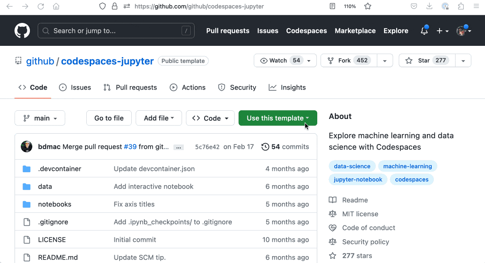

# sqlite-tutorial-pycon-2023

## What you'll need: Python 3

For the first part of this tutorial, you'll need a Python 3 interpreter with the `sqlite3` standard library module available.

You can run this on your own computer, or use a browser-based environment.

https://pyodide.org/en/stable/console.html will work for a purely browser-based (WebAssembly) environment.

For the second part, you'll also need the ability to `pip install` Python packages. Python 3 on your own laptop (maybe in a fresh virtual environment) is a good option here. You could also use [GitHub Codespaces](https://github.com/github/codespaces-jupyter) or [Google Colab](https://colab.research.google.com/) or [Jupyter Hub](https://jupyter.org/try) or your online notebook solution of choice.

I'll be working through the tutorial using GitHub Codespaces, using https://github.com/github/codespaces-jupyter



## Why SQLite?

- It's the database you already have - `sqlite3` has been built into Python since 2006
- It's screamingly fast, and surprisingly powerful
- Databases are just files on disk
- It can handle up to 2.8TB of data(!)
- It has some interesting characteristics: [Many Small Queries Are Efficient In SQLite](https://www.sqlite.org/np1queryprob.html)

## First steps

```python
import sqlite3

# Create an in-memory database
db = sqlite3.connect(":memory:")

print(db.execute("select sqlite_version()").fetchall())
# [('3.39.0',)]
```
Let's create a table:
```python
create table peps (
  id integer primary key,
  title text,
  description text
)
```

## SQLite column types

SQLite `create table` is easier than many other databases, because there are less types to worry about. There are four types you need to worry about:

- `integer`
- `real`
- `text`
- `blob`

Unlike other databases, length limits are neither required or enforced - so don't worry about `varchar(255)`, just use `text`.

Tables automatically get an ID column called `rowid` - an incrementing integer. This will be the primary key if you don't specify one.

If you specify `integer primary key` it will be auto-incrementing and will actually map to that underlying `rowid`.

You can set `id text primary key` for a text primary key - this will not increment, you will have to set it to a unique value for each row yourself. You could do this with UUIDs generated using `uuid.uuid4()` for example.

SQLite is loosely typed by default: you can insert any type into any column, even if it conflicts with the column type!

A lot of people find this very uncomfortable.

As-of SQLite 3.37.0 (2021-11-27) you can set [strict mode](https://www.sqlite.org/stricttables.html) on a table to opt-out of this loose typing:

```sql
create table peps (
  id integer primary key,
  title text,
  description text
) strict
```
